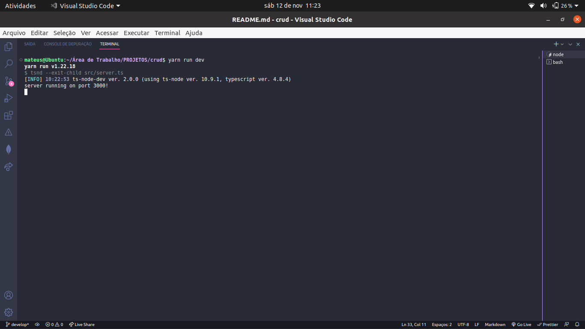
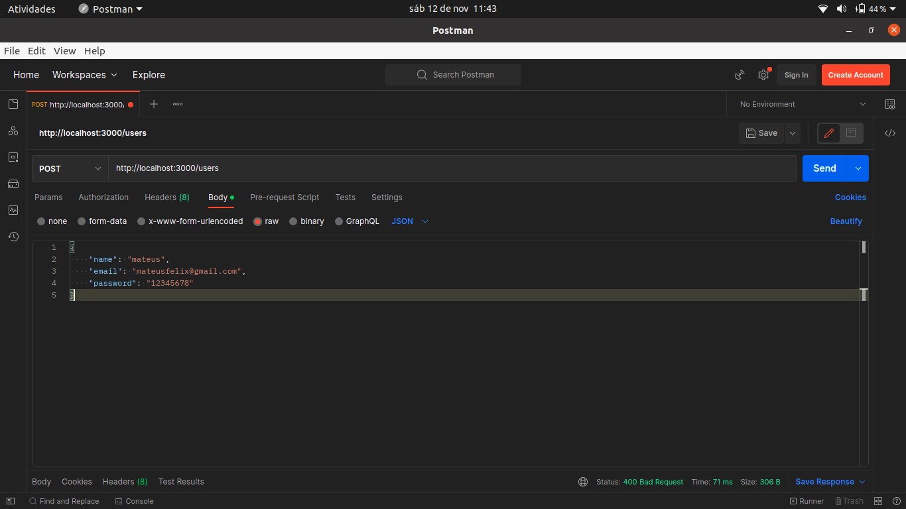
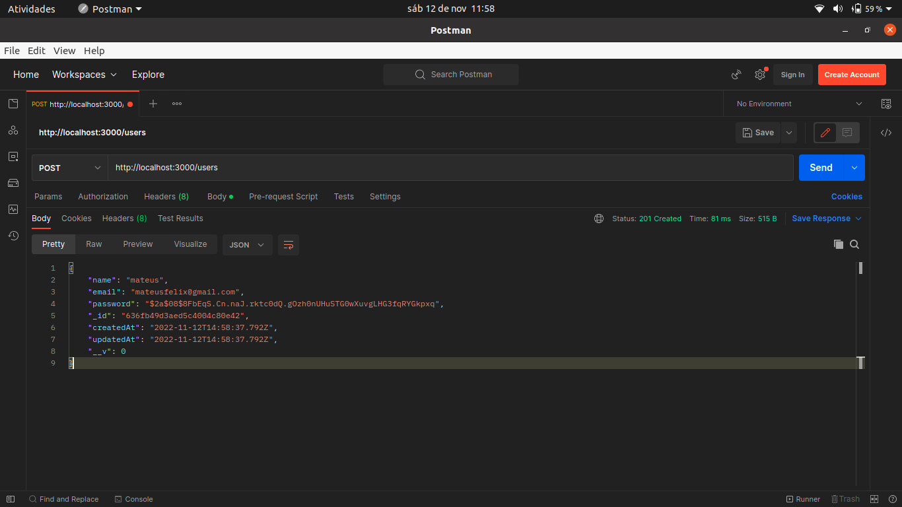
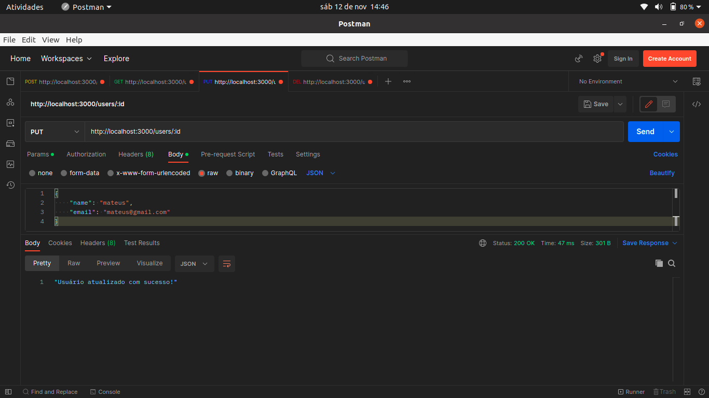
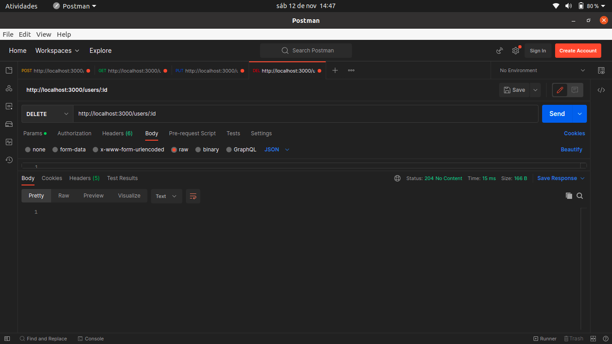

# CRUD (CREATE, READ, UPDATE, DELETE);

## Começando.

Olá, no projeto CRUD você pode criar um novo usuário, obter todos os usuários cadastrados, atualizar um usuário e deletar um usuário.

### 📋 Pré-requisitos

Para você rodar o projeto em sua maquina local você necessita ter essas tecnologias já instaladas ou você pode instalar:

- NodeJs: você pode instalar ([clicando aqui](https://nodejs.org/en/download/)).

- Banco de dados MongoDB: você pode instalar ([clicando aqui](https://www.mongodb.com/docs/manual/installation/)).

- Postman: você pode instalar o postman ([clicando aqui](https://www.postman.com/downloads/)).

- Yarn: você pode instalar o yarn ([clicando aqui](https://classic.yarnpkg.com/lang/en/docs/install/#debian-stable)).

## Executando o projeto em seu ambiente de desenvolvimento
Primerio você precisa instalar as depências com o comando: 

```
yarn install
```
Em seguida execute o comando para inicializar o projeto:

```
yarn run dev
```

<br><br>
Após executar o comando yarn run dev, abra seu terminal no seu editor de código, é para está assim:
<br><br>


<br><br>

Pronto, seu projeto já está pronto para criar, ler, atualizar e deletar, vamos lá. Primeiro abra o seu postman, e o configure como está na imagem!
<br><br>


<br><br>

Os campos name, email e password você pode modificar e colocar o seu nome, email e senha. Além disso, você pode fazer vários testes!
<br><br>

Agora você pode clicar no butão SEND, é para retornar esses campos: name, email, password, _id, createdAt, updatedAt.
<br><br>


<br> 

Pronto, você criou seu primeiro usuário!
<br><br>

Agora, para você ver o seu(s) usuário(s) você pode fazer uma requisição GET(pegue), vamos lá!<br><br>

OBS: para você pegar o(s) usuário(s) cadastrado(s) basta somente mudar o método de POST para GET!
<br><br>


<br>

Pronto, o(s) seu(s) usuário(s) cadstrado(s)!
<br><br>

Agora, para você atualizar um usuário você pode fazer um requisição PUT, vamos lá!<br><br>

OBS: para você atualizar um usuário basta somente você mudar o método de GET para PUT. Além disso, você precisa passar o campo _id do usuário que deseja atualizar. Você pode pegar o campo _id com método GET, mostrado anteriomente.


<br>

Perceba que logo depois de users você colocar o / e logo em seguida o _id, por exemplo, users/id. Além disso, as opções abaixo é os campos que desejamos atualizar!
<br><br>

Por fim, para você deletar um usuário basta fazer da mesma forma que no método PUT. Entretanto, não necessita passar os campos, somente o _id do usuário que desejamos deletar.<br><br>

OBS: para você deletar um usuário basta somente você mudar o método PUT para DELETE. Além disso, passar o _id como no método PUT.<br><br>

Pronto, fizemos as quatro operações do CRUD!!


<br>

## 🛠️ Tecnologias utilizadas.

- [NodeJS](https://nodejs.org/en/about/) - É uma tecnologia open-source(código aberto) e multiplataforma que permite criar ferramentas ao lado do servidor(backend) com javaScript. 

- [TypeScript](https://www.typescriptlang.org/) - É uma tecnologia desenvolvida pela microsoft, é um superSet do javaScript que permite utilizar tipagem estática facilitando a escrita do código.

- [MongoDB](https://www.mongodb.com/) - MongoDB é um banco de dados baseado em documentos, o mongoDB é um banco não relacional que permite armazenar dados em um formato semelhante ao JSON.

- [Moogoose](https://mongoosejs.com/) - Mongoose é uma biblioteca desenvolvida para fazer a conexão do ambiente javaScript(NodeJS) com o banco de dados moongoDB. Além disso, o mongoose nós permite criar esquemas, validar esquemas, gerenciar relacionanmento entre dados e ETC.

- [CORS](https://www.npmjs.com/package/cors) - CORS é um mecanismo que bloquea front-ends que não têm permições para acessar nossa API.

- [Express](https://expressjs.com/pt-br/) - Express é um fremework web que é utilizado em conjunto ao NodeJs. O express facilita muito no gerenciamento das nossas rotas, gerenciamento das requisições HTTP e muito mais!

- [Bcryptjs](https://www.npmjs.com/package/bcryptjs) - O bcryptjs é uma biblioteca para encriptação de dados. Estou utilizando essa biblioteca para encriptografa a senha do usuário.

- [Yup](https://www.npmjs.com/package/yup) - O yup é um construtor de esquemas para validação de campos, por exemplo, um formulário. Estou utilizando ele para
validar os dados na criação do usuário.

## ✒️ Autor

- [Mateus](https://github.com/mateusfelixdias).