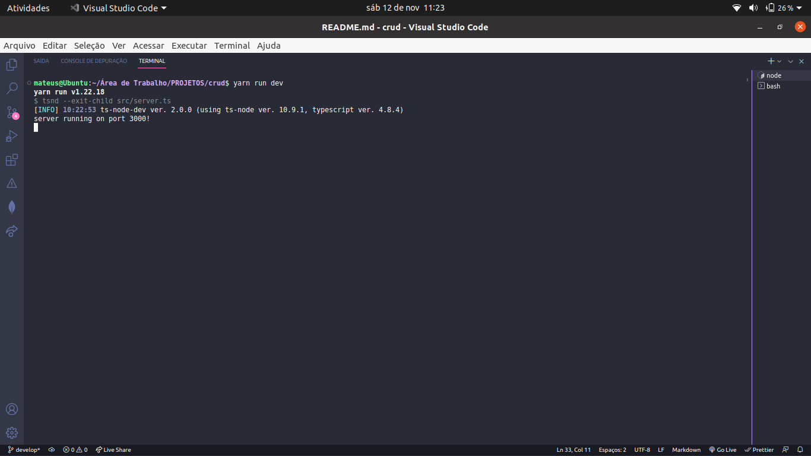

# CRUD (CREATE, READ, UPDATE, DELETE);

## Começando.

Olá, no projeto CRUD você pode criar um novo usuário, obter todos os usuários cadastrados, atualizar um tal usuário e deletar um tal usuário.

### 📋 Pré-requisitos

Para você rodar o projeto em sua maquina local você necessita ter essas tecnologias já instaladas:

- NodeJs: você pode instalar ([clicando aqui](https://nodejs.org/en/download/)).

- Banco de dados MongoDB: você pode instalar ([clicando aqui](https://www.mongodb.com/docs/manual/installation/)).

- Postman: você pode instalar o postman ([clicando aqui](https://www.postman.com/downloads/)).

- Yarn: você pode instalar o yarn ([clicando aqui](https://classic.yarnpkg.com/lang/en/docs/install/#debian-stable)).

## Executando o projeto em seu ambiente de desenvolvimento
Primerio você precisa instalar as depências com o comando: 

```
yarn install
```
Em seguida execute o comando para inicializar o projeto:

```
yarn run dev
```

Após executar o comando yarn run dev, abra seu terminal no seu editor de código, é para está assim:



## 🛠️ Tecnologias utilizadas.

- [NodeJS](https://nodejs.org/en/about/) - É uma tecnologia open-source(código aberto) e multiplataforma que permite criar ferramentas ao lado do servidor(backend) com javaScript. 

- [TypeScript](https://www.typescriptlang.org/) - É uma tecnologia desenvolvida pela microsoft, é um superSet do javaScript que permite utilizar tipagem estática facilitando a escrita do código.

- [MongoDB](https://www.mongodb.com/) - MongoDB é um banco de dados baseado em documentos, o mongoDB é um banco não relacional que permite armazenar dados em um formato semelhante ao JSON.

- [Moogoose](https://mongoosejs.com/) - Mongoose é uma biblioteca desenvolvida para fazer a conexão do ambiente javaScript(NodeJS) com o banco de dados moongoDB. Além disso, o mongoose nós permite criar esquemas, validar esquemas, gerenciar relacionanmento entre dados e ETC.

- [CORS](https://www.npmjs.com/package/cors) - CORS é um mecanismo que bloquea front-ends que não têm permições para acessar nossa API.

- [Express](https://expressjs.com/pt-br/) - Express é um fremework web que é utilizado em conjunto ao NodeJs. O express facilita muito no gerenciamento das nossas rotas, gerenciamento das requisições HTTP e muito mais!

## ✒️ Autor

- [Mateus](https://github.com/mateusfelixdias).